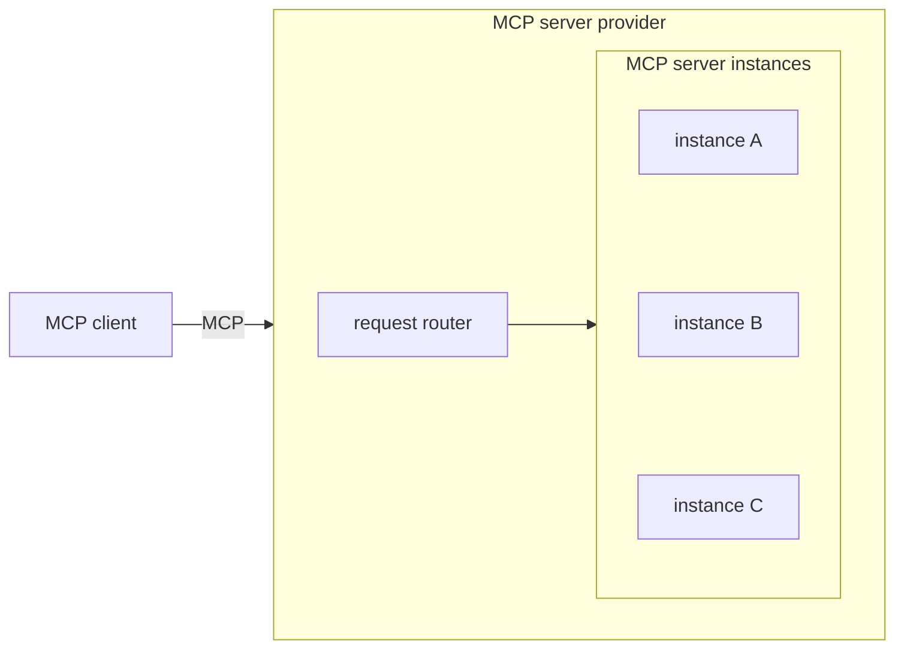

# remote MCP serverをサービスとして運用するために

```mermaid
flowchart LR
  C["MCP client"]

  subgraph P["MCP server provider"]
    direction LR
    R["request router"]

    subgraph S["MCP server instances"]
      direction TB
      S1["instance A"]
      S2["instance B"]
      S3["instance C"]

      S1 ~~~ S2
      S2 ~~~ S3
    end

    R --> S
  end

  C -->|"MCP"| P
```

負荷分散

集中するリクエストを 複数のインスタンスで処理したい

水平スケーリング

利用量に合わせて インスタンス数を増減したい

インスタンスの入れ替え

障害復旧や更新のために 入れ替えたい

負荷の変動や障害・更新に対応しながらサービスを提供し続けたい

