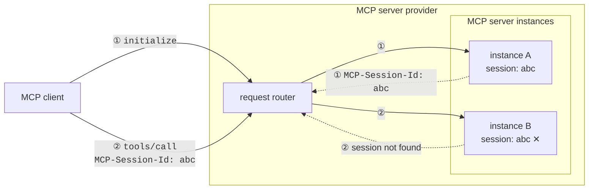

# protocol-level sessionは リクエストの振り分けを制約する

セッションをインスタンス内に保持する場合

```mermaid
flowchart LR
  C["MCP client"]

  subgraph P["MCP server provider"]
    direction LR
    R["request router"]

  subgraph S["MCP server instances"]
      direction TB
    A["instance A<br/>session: abc"]
    B["instance B<br/>session: abc ✕"]
    end
  end

    C -->|"① <code>initialize</code>"| R
  R -->|"①"| A
    A -.->|"① <code>MCP-Session-Id: abc</code>"| R

    C -->|"② <code>tools/call</code><br/><code>MCP-Session-Id: abc</code>"| R
  R -->|"②"| B
  B -.->|"② session not found"| R
```

セッションを保持するインスタンスへリクエストを届ける必要がある

→ 負荷分散やインスタンスの入れ替えに制約が生まれる

