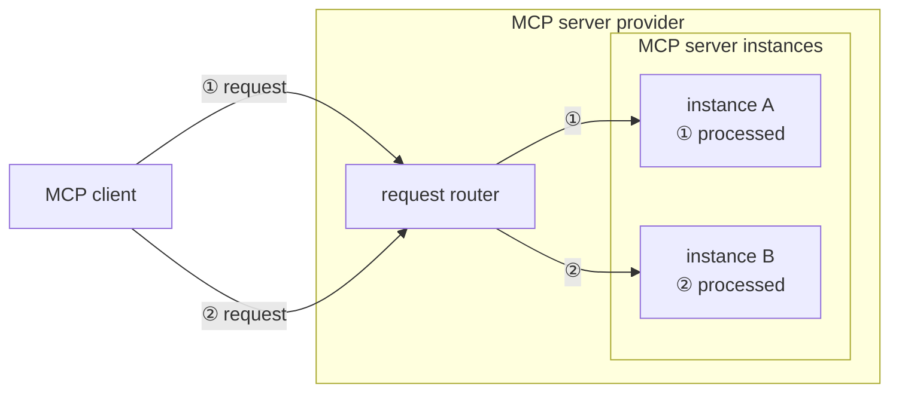

# MCP 2026-07-28: protocol-level sessionを廃止

::content::

```mermaid
flowchart LR
  C["MCP client"]
  subgraph P["MCP server provider"]
    direction LR
    R["request router"]
    subgraph S["MCP server instances"]
      direction TB
      A["instance A<br/>① processed"]
      B["instance B<br/>② processed"]
    end
  end

  C -->|"① request"| R
  R -->|"①"| A
  C -->|"② request"| R
  R -->|"②"| B
```

リクエストごとに処理するインスタンスを選べる

負荷分散やインスタンスの増減・入れ替えを行いやすくなる

