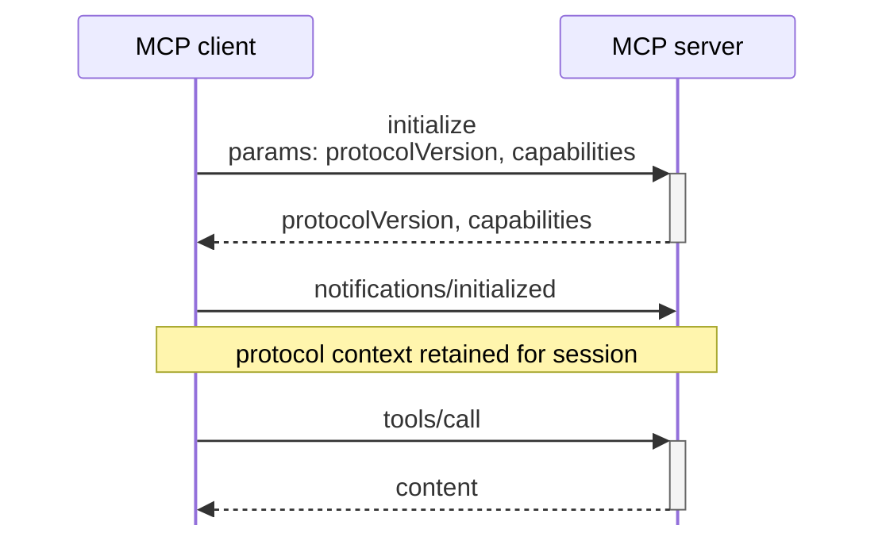
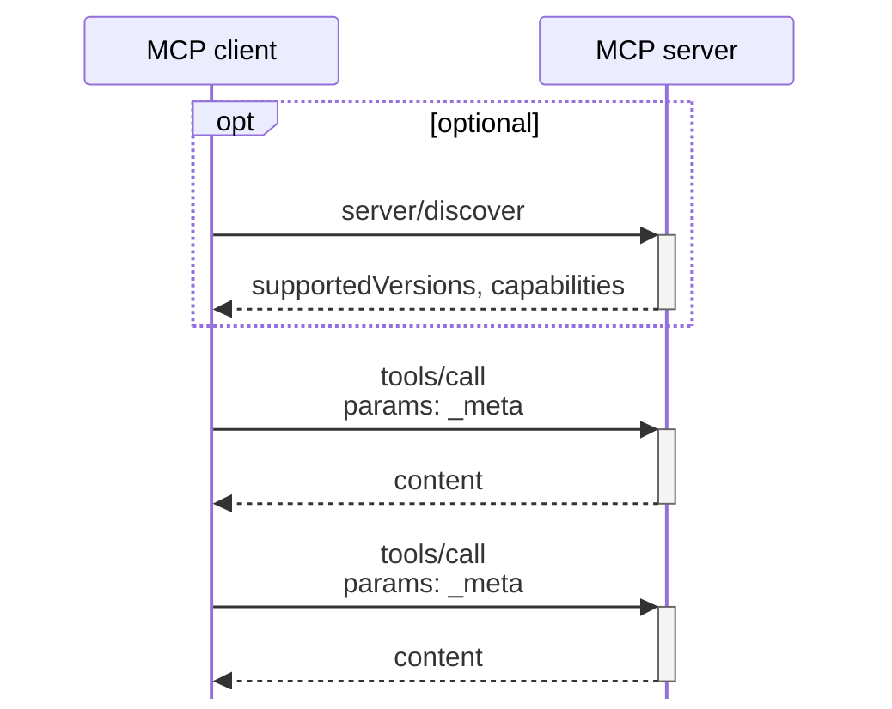

# protocol contextはリクエストごとに渡す

### Before

```mermaid {scale: 0.55}
---
config:
  themeCSS: '.messageText { font-family: monospace !important; font-size: 20px !important; }'
  sequence:
    mirrorActors: false
    height: 40
    messageMargin: 16
    noteMargin: 6
    messageFontFamily: monospace
    messageFontSize: 20
    actorFontSize: 20
    noteFontSize: 18
---
sequenceDiagram
    participant C as MCP client
    participant S as MCP server
    C->>+S: initialize<br/>params: protocolVersion, capabilities
    S-->>-C: protocolVersion, capabilities
    C->>S: notifications/initialized
    Note over C,S: protocol context retained for session
    C->>+S: tools/call
    S-->>-C: content
```

### After

```mermaid {scale: 0.55}
---
config:
  themeCSS: '.messageText { font-family: monospace !important; font-size: 20px !important; }'
  sequence:
    mirrorActors: false
    height: 40
    messageMargin: 16
    noteMargin: 6
    messageFontFamily: monospace
    messageFontSize: 20
    actorFontSize: 20
    noteFontSize: 18
---
sequenceDiagram
    participant C as MCP client
    participant S as MCP server
    opt optional
        C->>+S: server/discover
        S-->>-C: supportedVersions, capabilities
    end
    C->>+S: tools/call<br/>params: _meta
    S-->>-C: content
    C->>+S: tools/call<br/>params: _meta
    S-->>-C: content
```

<code>_meta</code>はメタデータを添えるためのフィールド 
バージョンとクライアントの対応機能を含める

各リクエストに必要なprotocol contextを含めて過去のやり取りに依存せず処理できる

